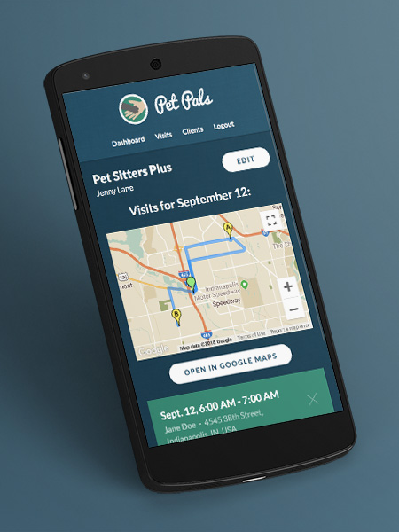

# Pet Pals

[About](#about) | [Technology Used](#tech) | [API](#api) | [Demo](#demo) | [Installation](#install)

## About:
Pet Pals helps pet care providers and their clients share information about their pets and services. Users can sign up as either a client (pet owner) or a provider (dog walker, pet sitter). The app is especially helpful for providers, since they can access client and pet information at all times via their mobile device.

### Client features:
* Can update their user profile and contact information
* Can add, edit and delete pets
* Can add and delete tasks for the pet care provider to complete at each scheduled visit
* Can view the next visit that their provider has scheduled

### Provider features:
* Can update their user profile and contact information
* Can add, update or delete clients
* Can add, edit and delete pets for their clients
* Can add and delete tasks for their clients 
* Can add and delete visits for their clients
* Dashboard displays a map of the next day's visits, routed in chronological order.

### Architecture highlights:
* The Mongo database has separate models for users, pets, visits and tasks. The models utilize relationships and middleware to manage ownership of records.
* Navigo front-end routing
* The client Javascript modules with public and private functions
* Continuous integration including automated API tests

## Technology used:

### Front-end
* HTML
* CSS with Flexbox
* JavaScript
* jQuery
* jQuery Timepicker Addon
* Google Place Autocomplete API
* Navigo.js

### Back-end
* Node.js
* Express.js
* bcryptjs
* JSON Web Token
* Passport.js
* Mongo DB
* Mongoose

### Development/Deployment
* Git/GitHub
* Chai/Chai-http
* Mocha
* mLab
* Postman
* Travis CI
* Heroku

## API Documentation
https://documenter.getpostman.com/view/4675682/RWTsrFTE

## Demo:
Users can access the application at the below URL:
https://petpals-app.herokuapp.com

Users can create new users in the app or use an existing test user below:

Test Provider:
jenny@lane.biz

Test Client:
john@doe.biz

Password for test users:
1234567890

## Installation Instructions
Dependencies:
* Node 10.5.0
* Mongo 3.1.0

config.js may need to be updated to suit your environment
